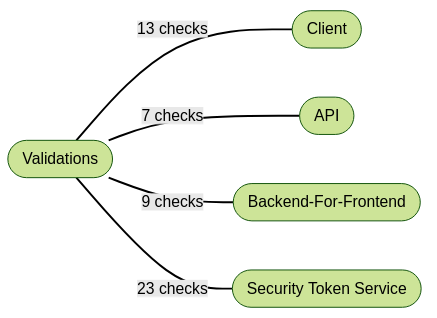

# OAuth2OIDC-Study

> :construction: Work in progress

Contains the materials used for the blog post about [OAuth2 and OpenID Connect](https://courses.pragmaticwebsecurity.com/courses/introduction-to-oauth-2-0-and-openid-connect). 

# Blog post link

xxx

# Security validations points

> Mind map file is created using markdown syntax and it is transformed using [MarkmapJS](https://markmap.js.org/repl) online tool.

They are defined in this [file](OAauth2_OIDC_Security_Validations.md).

Mind map view mode:



:speech_balloon: Mind map content is all content inside the **Application** section including the title.

# Lab

> Lab is based on [Keycloak](https://www.keycloak.org/getting-started/getting-started-docker) in Docker flavor.

> Default port 8080 is used.

> Base flow init URL is `http://localhost:8080/auth/realms/demo/protocol/openid-connect/auth?client_id=demo&redirect_uri=http://localhost:9500/App.html&state=114d367d-b319-44d0-a8cc-9a08c4a0bffd&response_mode=fragment&response_type=code&scope=openid profile api internal-api&nonce=78a3069c-74e8-4f5b-856a-9d890caabc06&prompt=consent`

## Properties

* Admin console is [here](http://localhost:8080/auth/admin) with creds `admin/admin`.
* Realm is named **demo** with a user having creds `demo/demo`.
* An OAuth/OIDC Client is present with name **demo**.
* An sample web client, via the [App.html](App.html) file, is provided (this one is defined into the lab configuration).

The lab configuration export is stored in file [Realm-Export.json](Realm-Export.json), so, you can import it via the *Import* feature. Use this [screen to create a realm](http://localhost:8080/auth/admin/master/console/#/create/realm).

## Run it

1) Open a shell and run the following set of commands to start a web server:

```shell
$ python --version
Python 3.7.5
$ cd [REPO_CLONE_FOLDER]
$ python -m http.server 9500
Serving HTTP on 0.0.0.0 port 9500 (http://0.0.0.0:9500/) ...
```

2) Open a shell and run the following set of commands to start a fresh Keycloak instance:

```shell
$ docker --version
Docker version 20.10.7, build f0df350
$ docker run -p 8080:8080 -e KEYCLOAK_USER=admin -e KEYCLOAK_PASSWORD=admin quay.io/keycloak/keycloak:14.0.0
...
[org.jboss.as] (Controller Boot Thread) WFLYSRV0051: Admin console listening on http://127.0.0.1:9990
```

3) Click [here](http://localhost:8080/auth/admin/master/console/#/create/realm) and import the [lab full demo configuration](Realm-Export.json) to setup the Keycloak instance.

4) Open this [url](http://localhost:9500/App.html) in a browser to access to the demo Web Client..

5) Lab is ready to used :sunglasses:
